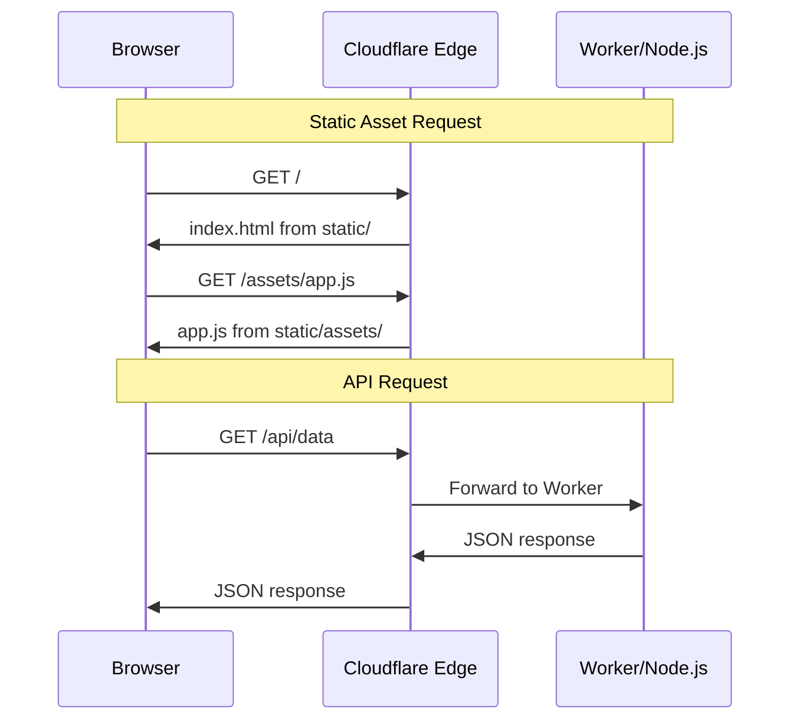

# Svelte SPA with Static Assets Integration Plan

This document outlines the architecture and implementation plan for adding a simple Svelte SPA (no SvelteKit) that generates static assets served via:
- **Cloudflare Workers**: New built-in Static Assets feature (`[assets]` in wrangler.toml)
- **Node.js**: Filesystem-based serving with `@hono/node-server/serve-static`

## Overview

### Goals
- Simple Svelte SPA using Vite (no SvelteKit complexity)
- Static assets (JS, CSS, images) served efficiently on both platforms
- Minimal platform-specific code
- Clean separation: `/` for frontend, `/api/*` for API routes

### Key Design Decisions
1. **Cloudflare Static Assets** (not embedded, not KV) - files served by edge before Worker runs
2. **Separate build outputs** - each platform gets its own `static/` folder
3. **No SPA client-side routing** - simple single page with API calls

## Architecture

```mermaid
graph TB
    subgraph Build Time
        SVELTE[packages/frontend<br/>Vite + Svelte]
        SVELTE --> BUILD[dist/<br/>index.html, assets/]
    end
    
    subgraph Deployment
        BUILD --> |copy| NODE_STATIC[platforms/nodejs/static/]
        BUILD --> |copy| CF_STATIC[platforms/cf-worker/static/]
    end
    
    subgraph Runtime - Cloudflare
        CF_STATIC --> |[assets] config| EDGE[Cloudflare Edge<br/>serves static files]
        EDGE --> |non-static requests| WORKER[Worker<br/>Hono /api/*]
    end
    
    subgraph Runtime - Node.js
        NODE_STATIC --> |serveStatic| NODEJS[Node.js Server<br/>Hono]
        NODEJS --> API_NODE[/api/* routes]
    end
```

## Request Flow



## Project Structure

```
faucet/
├── packages/
│   ├── frontend/                    # NEW: Svelte SPA
│   │   ├── src/
│   │   │   ├── main.ts              # Entry point
│   │   │   ├── App.svelte           # Root component
│   │   │   └── lib/                 # Components, stores, utils
│   │   ├── public/                  # Static assets copied as-is
│   │   │   └── favicon.ico
│   │   ├── index.html               # HTML template
│   │   ├── vite.config.ts
│   │   ├── svelte.config.js
│   │   ├── tsconfig.json
│   │   └── package.json
│   └── server/                      # UNCHANGED (mostly)
│       ├── src/
│       │   ├── index.ts             # MODIFY: prefix API routes
│       │   └── ...
│       └── package.json
├── platforms/
│   ├── cf-worker/
│   │   ├── static/                  # NEW: build output (gitignored)
│   │   ├── wrangler.toml            # MODIFY: add [assets]
│   │   └── src/worker.ts            # UNCHANGED
│   └── nodejs/
│       ├── static/                  # NEW: build output (gitignored)
│       └── src/cli.ts               # MODIFY: add serveStatic
└── package.json                     # MODIFY: add build scripts
```

## Implementation Steps

### Step 1: Create Frontend Package

**`packages/frontend/package.json`:**

```json
{
  "name": "faucet-frontend",
  "version": "0.0.0",
  "private": true,
  "type": "module",
  "scripts": {
    "dev": "vite",
    "build": "vite build",
    "preview": "vite preview",
    "check": "svelte-check --tsconfig ./tsconfig.json"
  },
  "devDependencies": {
    "@sveltejs/vite-plugin-svelte": "^4.0.0",
    "svelte": "^5.0.0",
    "svelte-check": "^4.0.0",
    "typescript": "^5.0.0",
    "vite": "^6.0.0"
  }
}
```

**`packages/frontend/vite.config.ts`:**

```typescript
import { defineConfig } from 'vite';
import { svelte } from '@sveltejs/vite-plugin-svelte';

export default defineConfig({
  plugins: [svelte()],
  build: {
    outDir: 'dist',
    assetsDir: 'assets',
    // Generate clean asset names
    rollupOptions: {
      output: {
        entryFileNames: 'assets/[name]-[hash].js',
        chunkFileNames: 'assets/[name]-[hash].js',
        assetFileNames: 'assets/[name]-[hash].[ext]'
      }
    }
  },
  server: {
    proxy: {
      '/api': 'http://localhost:2000'
    }
  }
});
```

**`packages/frontend/svelte.config.js`:**

```javascript
import { vitePreprocess } from '@sveltejs/vite-plugin-svelte';

export default {
  preprocess: vitePreprocess()
};
```

**`packages/frontend/tsconfig.json`:**

```json
{
  "extends": "@sveltejs/kit/tsconfig.json",
  "compilerOptions": {
    "target": "ESNext",
    "useDefineForClassFields": true,
    "module": "ESNext",
    "resolveJsonModule": true,
    "allowJs": true,
    "checkJs": true,
    "isolatedModules": true,
    "moduleDetection": "force",
    "strict": true,
    "noEmit": true
  },
  "include": ["src/**/*.ts", "src/**/*.svelte"]
}
```

**`packages/frontend/index.html`:**

```html
<!DOCTYPE html>
<html lang="en">
  <head>
    <meta charset="UTF-8" />
    <meta name="viewport" content="width=device-width, initial-scale=1.0" />
    <title>Faucet</title>
    <link rel="icon" type="image/x-icon" href="/favicon.ico" />
  </head>
  <body>
    <div id="app"></div>
    <script type="module" src="/src/main.ts"></script>
  </body>
</html>
```

**`packages/frontend/src/main.ts`:**

```typescript
import App from './App.svelte';
import { mount } from 'svelte';

const app = mount(App, {
  target: document.getElementById('app')!
});

export default app;
```

**`packages/frontend/src/App.svelte`:**

```svelte
<script lang="ts">
  let message = $state('Hello from Faucet!');

  async function fetchData() {
    const response = await fetch('/api/dummy');
    const data = await response.json();
    message = JSON.stringify(data, null, 2);
  }
</script>

<main>
  <h1>Faucet</h1>
  <p>{message}</p>
  <button onclick={fetchData}>Fetch API Data</button>
</main>

<style>
  main {
    font-family: system-ui, sans-serif;
    padding: 2rem;
    max-width: 800px;
    margin: 0 auto;
  }
  
  button {
    padding: 0.5rem 1rem;
    cursor: pointer;
  }
</style>
```

### Step 2: Update Server to Prefix API Routes

**`packages/server/src/index.ts`** - Only change is prefixing the API route:

```typescript
import {Hono} from 'hono';
import {cors} from 'hono/cors';
import {ServerOptions} from './types.js';
import {hc} from 'hono/client';
import {HTTPException} from 'hono/http-exception';
import {Env} from './env.js';
import {getDummyAPI} from './api/dummy.js';

export type {Env};

const corsSetup = cors({
  origin: '*',
  allowHeaders: [
    'X-Custom-Header',
    'Upgrade-Insecure-Requests',
    'Content-Type',
    'SIGNATURE',
  ],
  allowMethods: ['POST', 'GET', 'HEAD', 'OPTIONS'],
  exposeHeaders: ['Content-Length', 'X-Kuma-Revision'],
  maxAge: 600,
  credentials: true,
});

export function createServer<CustomEnv extends Env>(
  options: ServerOptions<CustomEnv>,
) {
  const app = new Hono<{Bindings: CustomEnv}>();

  const dummy = getDummyAPI(options);

  return app
    .use('/api/*', corsSetup)     // CHANGED: prefix with /api
    .route('/api', dummy)          // CHANGED: mount under /api
    .onError((err, c) => {
      const config = c.get('config');
      const env = config?.env || {};
      console.error(err);
      if (err instanceof HTTPException) {
        if (err.res) {
          return err.getResponse();
        }
      }

      return c.json(
        {
          success: false,
          errors: [
            {
              name: 'name' in err ? err.name : undefined,
              code: 'code' in err ? err.code : 5000,
              status: 'status' in err ? err.status : undefined,
              message: err.message,
              cause: env.DEV ? err.cause : undefined,
              stack: env.DEV ? err.stack : undefined,
            },
          ],
        },
        500,
      );
    });
}

export type App = ReturnType<typeof createServer>;

const client = hc<App>('');
export type Client = typeof client;
export const createClient = (...args: Parameters<typeof hc>): Client =>
  hc<App>(...args);
```

### Step 3: Configure Cloudflare Workers

**`platforms/cf-worker/wrangler.toml`** - Add assets configuration:

```toml
name = "faucet-worker"
main = "src/worker.ts"
compatibility_date = "2024-01-01"

# Static Assets - served by Cloudflare edge before Worker runs
[assets]
directory = "./static"

[[d1_databases]]
binding = "DB"
database_name = "faucet-db"
database_id = "your-database-id"
```

**`platforms/cf-worker/.gitignore`** - Add static folder:

```
# environment variables
.env*.local

# node modules
node_modules

# wrangler
.wrangler

# static assets (copied from frontend build)
static/
```

**No changes needed to `platforms/cf-worker/src/worker.ts`** - Static files are served by Cloudflare edge before the Worker runs. The Worker only handles `/api/*` routes.

### Step 4: Configure Node.js Platform

**`platforms/nodejs/package.json`** - Ensure @hono/node-server is installed:

```json
{
  "dependencies": {
    "@hono/node-server": "^1.12.0",
    "template-agnostic-server-app": "workspace:*",
    "remote-sql-libsql": "^0.0.6",
    "@libsql/client": "^0.6.0",
    "commander": "^12.0.0",
    "ldenv": "^0.3.12"
  }
}
```

**`platforms/nodejs/src/cli.ts`** - Add static file serving:

```typescript
#!/usr/bin/env node
import "named-logs-context";
import { createServer, type Env } from "template-agnostic-server-app";
import { serve } from "@hono/node-server";
import { serveStatic } from "@hono/node-server/serve-static";
import { RemoteLibSQL } from "remote-sql-libsql";
import { createClient } from "@libsql/client";
import fs from "node:fs";
import path from "node:path";
import { Command } from "commander";
import { loadEnv } from "ldenv";
import { Hono } from "hono";

const __dirname = import.meta.dirname;

loadEnv({
  defaultEnvFile: path.join(__dirname, "../.env.default"),
});

type NodeJSEnv = Env & {
  DB: string;
};

async function main() {
  const pkg = JSON.parse(
    fs.readFileSync(path.join(__dirname, "../package.json"), "utf-8"),
  );
  const program = new Command();

  program
    .name("faucet-nodejs")
    .version(pkg.version)
    .usage(`faucet-nodejs [--port 2000]`)
    .description("run faucet server as a node process")
    .option("-p, --port <port>");

  program.parse(process.argv);

  type Options = {
    port?: string;
  };

  const options: Options = program.opts();
  const port = options.port ? parseInt(options.port) : 2000;

  const env = process.env as NodeJSEnv;
  const db = env.DB;

  const client = createClient({
    url: db,
  });
  const remoteSQL = new RemoteLibSQL(client);

  // Create API server
  const apiApp = createServer<NodeJSEnv>({
    getDB: () => remoteSQL,
    getEnv: () => env,
  });

  // Create main app with static serving
  const app = new Hono();
  
  // Mount API routes
  app.route('/', apiApp);
  
  // Serve static files
  const staticDir = path.join(__dirname, "../static");
  if (fs.existsSync(staticDir)) {
    // Serve static assets
    app.use('/*', serveStatic({ root: './static' }));
    
    // Fallback to index.html for SPA (if needed in future)
    app.get('*', serveStatic({ root: './static', path: '/index.html' }));
  }

  serve({
    fetch: app.fetch,
    port,
  });

  console.log(`Server is running on http://localhost:${port}`);
}
main();
```

**`platforms/nodejs/.gitignore`** - Add static folder:

```
# build output
dist/

# static assets (copied from frontend build)
static/
```

### Step 5: Add Build Scripts

**Root `package.json`** - Add frontend build and copy scripts:

```json
{
  "scripts": {
    "build:frontend": "pnpm --filter faucet-frontend build",
    "build:server": "pnpm --filter template-agnostic-server-app build",
    "build:copy-static:nodejs": "rm -rf platforms/nodejs/static && cp -r packages/frontend/dist platforms/nodejs/static",
    "build:copy-static:cf": "rm -rf platforms/cf-worker/static && cp -r packages/frontend/dist platforms/cf-worker/static",
    "build:copy-static": "pnpm build:copy-static:nodejs && pnpm build:copy-static:cf",
    "build": "pnpm build:frontend && pnpm build:copy-static && pnpm build:server",
    "dev:frontend": "pnpm --filter faucet-frontend dev",
    "dev:server": "pnpm --filter template-agnostic-server-app dev"
  }
}
```

**Update `pnpm-workspace.yaml`** to include frontend:

```yaml
packages:
  - "packages/*"
  - "platforms/*"
```

### Step 6: Update Workspace .gitignore

Ensure platform static folders are ignored in the root `.gitignore`:

```
# Platform-specific static assets (copied from frontend build)
platforms/nodejs/static/
platforms/cf-worker/static/
```

## Development Workflow

### Local Development (Frontend Only)

```bash
# Start frontend dev server with API proxy
pnpm --filter faucet-frontend dev
# Access at http://localhost:5173
# API calls proxied to http://localhost:2000
```

### Local Development (Full Stack)

Terminal 1:
```bash
# Start API server
cd platforms/nodejs
pnpm dev
# API at http://localhost:2000
```

Terminal 2:
```bash
# Start frontend with proxy
pnpm --filter faucet-frontend dev
# App at http://localhost:5173
```

### Production Build

```bash
# Full build
pnpm build

# This runs:
# 1. pnpm build:frontend      - Build Svelte app to packages/frontend/dist
# 2. pnpm build:copy-static   - Copy to platforms/*/static/
# 3. pnpm build:server        - Build server TypeScript
```

### Deployment

**Cloudflare Workers:**
```bash
cd platforms/cf-worker
wrangler deploy
# Static files deployed via [assets], Worker handles /api/*
```

**Node.js:**
```bash
cd platforms/nodejs
node dist/cli.js --port 3000
# Serves both static files and API from single process
```

## Caching Strategy

### Cloudflare Workers
Cloudflare's Static Assets feature automatically:
- Sets proper `Cache-Control` headers
- Serves from edge cache
- Handles `ETag` and conditional requests

### Node.js
For production, consider:
- Using a reverse proxy (nginx) for static files
- Adding cache headers in `serveStatic` options

```typescript
app.use('/*', serveStatic({ 
  root: './static',
  // Hashed assets get long cache
  onFound: (path, c) => {
    if (path.includes('/assets/')) {
      c.header('Cache-Control', 'public, max-age=31536000, immutable');
    }
  }
}));
```

## File Sizes and Performance

| Metric | Cloudflare Workers | Node.js |
|--------|-------------------|---------|
| Static file serving | Edge (0ms latency) | Server filesystem |
| Worker/Server bundle | Small (no assets embedded) | Small |
| Cold start | Fast | N/A |
| Asset caching | Edge-level | In-memory or proxy |

## Implementation Checklist

- [ ] Create `packages/frontend/` directory structure
- [ ] Add `packages/frontend/package.json` with Vite + Svelte deps
- [ ] Add `packages/frontend/vite.config.ts`
- [ ] Add `packages/frontend/svelte.config.js`
- [ ] Add `packages/frontend/tsconfig.json`
- [ ] Add `packages/frontend/index.html`
- [ ] Add `packages/frontend/src/main.ts`
- [ ] Add `packages/frontend/src/App.svelte`
- [ ] Update `packages/server/src/index.ts` to prefix API routes with `/api`
- [ ] Update `platforms/cf-worker/wrangler.toml` with `[assets]` config
- [ ] Update `platforms/cf-worker/.gitignore` to ignore `static/`
- [ ] Update `platforms/nodejs/src/cli.ts` with static file serving
- [ ] Update `platforms/nodejs/.gitignore` to ignore `static/`
- [ ] Update root `package.json` with build scripts
- [ ] Verify `pnpm-workspace.yaml` includes packages
- [ ] Test local development workflow
- [ ] Test production build
- [ ] Test Cloudflare Workers deployment
- [ ] Test Node.js deployment
