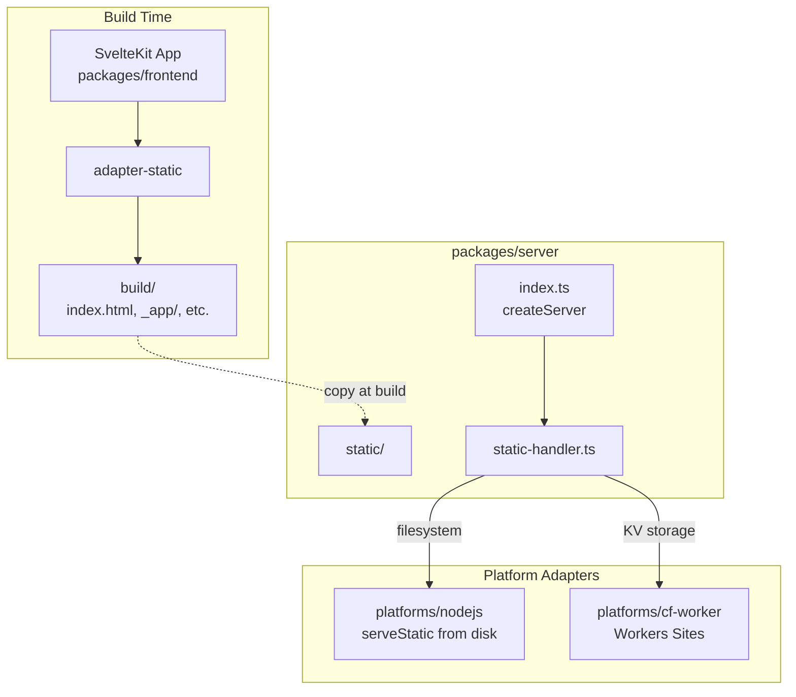

# SvelteKit Frontend Integration Plan

This document outlines the architecture and implementation plan for adding a SvelteKit frontend that generates static assets to be served by the Hono-based server across all platforms.

## Overview

The goal is to create a SvelteKit application that:
- Generates static assets (HTML, JS, CSS) at build time
- Is served efficiently by the existing Hono server in `packages/server`
- Works optimally across all platforms (Cloudflare Workers, Node.js)

## Architecture



## Project Structure

```
faucet/
├── packages/
│   ├── frontend/                    # NEW: SvelteKit application
│   │   ├── src/
│   │   │   ├── routes/
│   │   │   │   ├── +page.svelte
│   │   │   │   └── +layout.svelte
│   │   │   ├── lib/
│   │   │   └── app.html
│   │   ├── static/                  # Static assets (favicon, etc.)
│   │   ├── svelte.config.js
│   │   ├── vite.config.js
│   │   ├── tsconfig.json
│   │   └── package.json
│   └── server/
│       ├── src/
│       │   ├── index.ts             # MODIFY: Add static handler support
│       │   ├── types.ts             # MODIFY: Extend ServerOptions
│       │   └── ...
│       └── static/                  # Build output (gitignored)
├── platforms/
│   ├── cf-worker/
│   │   ├── static/                  # Build output for Workers Sites
│   │   ├── wrangler.toml            # MODIFY: Add [site] config
│   │   └── src/worker.ts            # MODIFY: Add static handler
│   └── nodejs/
│       ├── static/                  # Build output
│       └── src/cli.ts               # MODIFY: Add static handler
└── package.json                     # MODIFY: Add build scripts
```

## Implementation Steps

### Step 1: Create SvelteKit Frontend Package

Create `packages/frontend/package.json`:

```json
{
  "name": "faucet-frontend",
  "version": "0.0.0",
  "private": true,
  "type": "module",
  "scripts": {
    "dev": "vite dev",
    "build": "vite build",
    "preview": "vite preview",
    "check": "svelte-kit sync && svelte-check --tsconfig ./tsconfig.json"
  },
  "devDependencies": {
    "@sveltejs/adapter-static": "^3.0.0",
    "@sveltejs/kit": "^2.0.0",
    "@sveltejs/vite-plugin-svelte": "^4.0.0",
    "svelte": "^5.0.0",
    "svelte-check": "^4.0.0",
    "typescript": "^5.0.0",
    "vite": "^6.0.0"
  }
}
```

Create `packages/frontend/svelte.config.js`:

```javascript
import adapter from '@sveltejs/adapter-static';

/** @type {import('@sveltejs/kit').Config} */
const config = {
  kit: {
    adapter: adapter({
      pages: 'build',
      assets: 'build',
      fallback: 'index.html',  // SPA mode - all routes fallback to index.html
      precompress: true,       // Generate .gz and .br files for performance
      strict: true
    }),
    paths: {
      base: ''  // Change to '/app' if serving under a subpath
    }
  }
};

export default config;
```

Create `packages/frontend/vite.config.js`:

```javascript
import { sveltekit } from '@sveltejs/kit/vite';
import { defineConfig } from 'vite';

export default defineConfig({
  plugins: [sveltekit()],
  server: {
    proxy: {
      '/api': 'http://localhost:2000'  // Proxy API requests in dev mode
    }
  }
});
```

### Step 2: Modify Server to Support Static Handler

Update `packages/server/src/types.ts`:

```typescript
import {Context, Next} from 'hono';
import type {RemoteSQL} from 'remote-sql';

export type StaticHandler<CustomEnv> = (
  c: Context<{Bindings: CustomEnv}>,
  next: Next
) => Promise<Response | void>;

export type ServerOptions<CustomEnv extends Env> = {
  getDB: (c: Context<{Bindings: CustomEnv}>) => RemoteSQL;
  getEnv: (c: Context<{Bindings: CustomEnv}>) => CustomEnv;
  staticHandler?: StaticHandler<CustomEnv>;  // NEW
};
```

Update `packages/server/src/index.ts`:

```typescript
import {Hono} from 'hono';
import {cors} from 'hono/cors';
import {ServerOptions} from './types.js';
import {hc} from 'hono/client';
import {HTTPException} from 'hono/http-exception';
import {Env} from './env.js';
import {getDummyAPI} from './api/dummy.js';

export type {Env};

const corsSetup = cors({
  origin: '*',
  allowHeaders: [
    'X-Custom-Header',
    'Upgrade-Insecure-Requests',
    'Content-Type',
    'SIGNATURE',
  ],
  allowMethods: ['POST', 'GET', 'HEAD', 'OPTIONS'],
  exposeHeaders: ['Content-Length', 'X-Kuma-Revision'],
  maxAge: 600,
  credentials: true,
});

export function createServer<CustomEnv extends Env>(
  options: ServerOptions<CustomEnv>,
) {
  const app = new Hono<{Bindings: CustomEnv}>();

  const dummy = getDummyAPI(options);

  // API routes
  app.use('/api/*', corsSetup);
  app.route('/api', dummy);

  // Static file handler (if provided)
  if (options.staticHandler) {
    app.use('*', options.staticHandler);
  }

  // Error handler
  app.onError((err, c) => {
    const config = c.get('config');
    const env = config?.env || {};
    console.error(err);
    if (err instanceof HTTPException) {
      if (err.res) {
        return err.getResponse();
      }
    }

    return c.json(
      {
        success: false,
        errors: [
          {
            name: 'name' in err ? err.name : undefined,
            code: 'code' in err ? err.code : 5000,
            status: 'status' in err ? err.status : undefined,
            message: err.message,
            cause: env.DEV ? err.cause : undefined,
            stack: env.DEV ? err.stack : undefined,
          },
        ],
      },
      500,
    );
  });

  return app;
}

export type App = ReturnType<typeof createServer>;

const client = hc<App>('');
export type Client = typeof client;
export const createClient = (...args: Parameters<typeof hc>): Client =>
  hc<App>(...args);
```

### Step 3: Configure Node.js Platform

Update `platforms/nodejs/package.json` to add static serving dependency:

```json
{
  "dependencies": {
    "@hono/node-server": "^1.12.0"
  }
}
```

Update `platforms/nodejs/src/cli.ts`:

```typescript
#!/usr/bin/env node
import "named-logs-context";
import { createServer, type Env } from "template-agnostic-server-app";
import { serve } from "@hono/node-server";
import { serveStatic } from "@hono/node-server/serve-static";
import { RemoteLibSQL } from "remote-sql-libsql";
import { createClient } from "@libsql/client";
import fs from "node:fs";
import path from "node:path";
import { Command } from "commander";
import { loadEnv } from "ldenv";

const __dirname = import.meta.dirname;

loadEnv({
  defaultEnvFile: path.join(__dirname, "../.env.default"),
});

type NodeJSEnv = Env & {
  DB: string;
};

async function main() {
  const pkg = JSON.parse(
    fs.readFileSync(path.join(__dirname, "../package.json"), "utf-8"),
  );
  const program = new Command();

  program
    .name("template-agnostic-server-nodejs")
    .version(pkg.version)
    .usage(`template-agnostic-server-nodejs [--port 2000] [--sql <sql-folder>]`)
    .description("run template-agnostic-server-nodejs as a node process")
    .option("-p, --port <port>");

  program.parse(process.argv);

  type Options = {
    port?: string;
  };

  const options: Options = program.opts();
  const port = options.port ? parseInt(options.port) : 2000;

  const env = process.env as NodeJSEnv;

  const db = env.DB;

  const client = createClient({
    url: db,
  });
  const remoteSQL = new RemoteLibSQL(client);

  const staticRoot = path.join(__dirname, "../static");
  const hasStaticFiles = fs.existsSync(staticRoot);

  const app = createServer<NodeJSEnv>({
    getDB: () => remoteSQL,
    getEnv: () => env,
    staticHandler: hasStaticFiles 
      ? serveStatic({
          root: staticRoot,
          rewriteRequestPath: (reqPath) => {
            // SPA fallback: serve index.html for routes without file extension
            if (!reqPath.includes('.')) {
              return '/index.html';
            }
            return reqPath;
          }
        })
      : undefined,
  });

  if (db === ":memory:") {
    // console.log(`executing setup...`);
    // can fetch an admin route with the token if needed
  }

  serve({
    fetch: app.fetch,
    port,
  });

  console.log(`Server is running on http://localhost:${port}`);
}
main();
```

### Step 4: Configure Cloudflare Workers Platform

Update `platforms/cf-worker/wrangler.toml`:

```toml
name = "faucet-worker"
main = "src/worker.ts"
compatibility_date = "2024-01-01"

[site]
bucket = "./static"

[[d1_databases]]
binding = "DB"
database_name = "faucet-db"
database_id = "your-database-id"
```

Update `platforms/cf-worker/src/worker.ts`:

```typescript
import 'named-logs-context';
import {RemoteD1} from 'remote-sql-d1';
import {CloudflareEnv} from './env.js';
import {logs} from 'named-logs';
import {track, enable as enableWorkersLogger} from 'workers-logger';
import {ExecutionContext} from '@cloudflare/workers-types/experimental';
import {logflareReport} from './utils/logflare.js';
import {consoleReporter} from './utils/basicReporters.js';
import {createServer} from 'template-agnostic-server-app';
import {serveStatic} from 'hono/cloudflare-workers';
import pkg from 'template-agnostic-server-app/package.json';

// @ts-ignore - Generated by Wrangler
import manifest from '__STATIC_CONTENT_MANIFEST';

enableWorkersLogger('*');
const logger = logs('worker');

async function wrapWithLogger(
  request: Request,
  env: CloudflareEnv,
  ctx: ExecutionContext,
  callback: (
    request: Request,
    env: CloudflareEnv,
    ctx: ExecutionContext,
  ) => Promise<Response>,
): Promise<Response> {
  // ... existing logging code ...
}

export const app = createServer<CloudflareEnv>({
  getDB: (c) => new RemoteD1(c.env.DB),
  getEnv: (c) => c.env,
  staticHandler: serveStatic({
    root: './',
    manifest,
    // SPA fallback
    onNotFound: (path, c) => {
      return serveStatic({
        root: './',
        manifest,
        path: '/index.html',
      })(c, async () => {});
    },
  }),
});

const fetch = async (
  request: Request,
  env: CloudflareEnv,
  ctx: ExecutionContext,
) => {
  return wrapWithLogger(request, env, ctx, async () => {
    return app.fetch(request, env, ctx);
  });
};

export default {
  fetch,
};
```

### Step 5: Add Build Scripts

Update root `package.json`:

```json
{
  "scripts": {
    "build:frontend": "pnpm --filter faucet-frontend build",
    "build:server": "pnpm --filter template-agnostic-server-app build",
    "build:copy-static:nodejs": "mkdir -p platforms/nodejs/static && cp -r packages/frontend/build/* platforms/nodejs/static/",
    "build:copy-static:cf": "mkdir -p platforms/cf-worker/static && cp -r packages/frontend/build/* platforms/cf-worker/static/",
    "build:copy-static": "pnpm build:copy-static:nodejs && pnpm build:copy-static:cf",
    "build": "pnpm build:frontend && pnpm build:copy-static && pnpm build:server",
    "dev:frontend": "pnpm --filter faucet-frontend dev",
    "dev:server": "pnpm --filter template-agnostic-server-app dev"
  }
}
```

### Step 6: Update .gitignore Files

Add to `platforms/nodejs/.gitignore`:

```
static/
```

Add to `platforms/cf-worker/.gitignore`:

```
static/
```

## Performance Optimizations

### Caching Strategy

| Asset Type | Cache-Control Header | Notes |
|------------|---------------------|-------|
| `/_app/immutable/*` | `public, max-age=31536000, immutable` | Content-hashed, never changes |
| `/_app/version.json` | `no-cache` | Version check for updates |
| `/index.html` | `public, max-age=0, must-revalidate` | Entry point, always fresh |
| Other assets | `public, max-age=3600` | Reasonable cache time |

### Compression

SvelteKit's `precompress: true` option generates:
- `.gz` (gzip) files
- `.br` (brotli) files

Both Cloudflare Workers and most Node.js reverse proxies will automatically serve these compressed versions when the client supports them.

### Platform Comparison

| Approach | Cold Start | Bundle Size | Best For |
|----------|------------|-------------|----------|
| **Workers Sites (KV)** | ~50ms | Small worker | Production, large apps |
| **Node.js Filesystem** | N/A | N/A | Local dev, Node.js hosting |

## Development Workflow

### Local Development

1. Start the API server:
   ```bash
   pnpm --filter nodejs dev
   ```

2. Start the frontend dev server (with API proxy):
   ```bash
   pnpm --filter faucet-frontend dev
   ```

3. Access the app at `http://localhost:5173` (Vite default port)

### Production Build

```bash
pnpm build
```

This will:
1. Build the SvelteKit frontend to `packages/frontend/build`
2. Copy static files to each platform's `static/` directory
3. Build the server package

### Deployment

**Cloudflare Workers:**
```bash
cd platforms/cf-worker
wrangler deploy
```

**Node.js:**
```bash
cd platforms/nodejs
node dist/cli.js
```

## API Route Prefix

With this architecture, all API routes are prefixed with `/api`:

- `GET /api/...` - API endpoints
- `GET /*` - Static files / SPA routes

This separation ensures clean routing between the API and frontend.

## Checklist

- [ ] Create `packages/frontend` SvelteKit app
- [ ] Configure `adapter-static` with `precompress: true`
- [ ] Update `packages/server/src/types.ts` with `StaticHandler` type
- [ ] Update `packages/server/src/index.ts` to support static handler
- [ ] Prefix API routes with `/api`
- [ ] Update `platforms/nodejs/src/cli.ts` with static serving
- [ ] Update `platforms/cf-worker/wrangler.toml` with `[site]` config
- [ ] Update `platforms/cf-worker/src/worker.ts` with Workers Sites
- [ ] Add build scripts to root `package.json`
- [ ] Update `.gitignore` files for `static/` directories
- [ ] Test local development workflow
- [ ] Test production build and deployment
